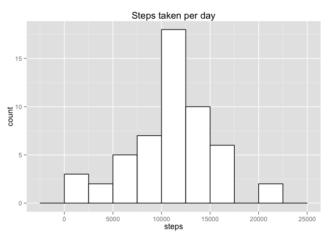
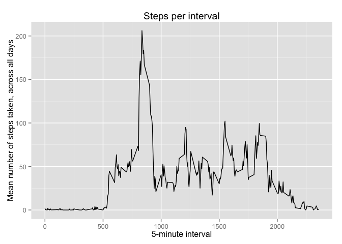
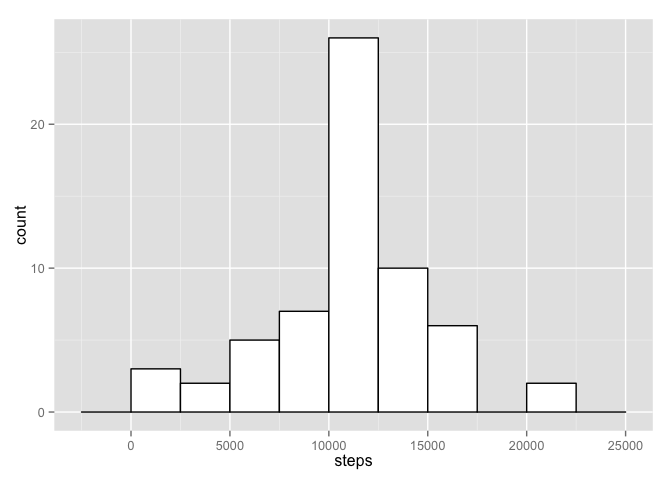
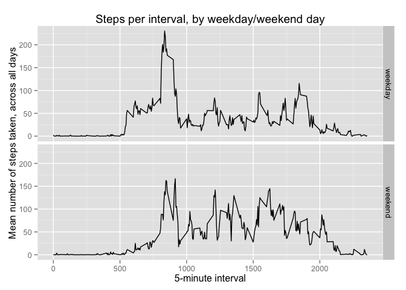

# Reproducible Research: Peer Assessment 1
Kevin Michael Rhodes  
December 14, 2014  
#Introduction
This document provides the code and documentation necessary to reproduce an analysis of motion data for peer assessment #1 from the Coursera course on [Reproducible Research][1].


## Loading and preprocessing the data

*Load the data*

```r
setwd("/Users/kevin/Dropbox/Coursera/5 - Reproducible Research/Peer Assessment 1/RepData_PeerAssessment1/Data")
datasetUrl = "https://d396qusza40orc.cloudfront.net/repdata%2Fdata%2Factivity.zip"
datasetZip = "activity.zip"
download.file(url = datasetUrl, destfile = datasetZip, method="curl")
unzip(zipfile = datasetZip)
activity_table = read.csv(file="activity.csv", header = TRUE, na.strings="NA", sep=",")
```

*Process/transform the data (if necessary) into a format suitable for your analysis*

```r
#use date objects
activity_table$date <- as.Date(x=activity_table$date, format="%Y-%m-%d")

#split into subsets by date
steps_by_date <- aggregate(steps ~ date, data = activity_table, sum, na.rm = TRUE)
```

## What is mean total number of steps taken per day?

*Make a histogram of the total number of steps taken each day*

```r
#histogram
ggplot(steps_by_date, aes(x=steps)) +
    geom_histogram(binwidth=2500, colour="black", fill="white") +
    ggtitle("Steps taken per day")
```

 

*Calculate and report the mean and median total number of steps taken per day*

```r
#mean and median steps
mean_steps <- mean(steps_by_date$steps)
median_steps <- median(steps_by_date$steps)
```

The mean total number of steps taken each day: **10766.**  The median total number of steps taken each day: **10765**.  

## What is the average daily activity pattern?
*Make a time series plot of the 5-minute interval (x-axis) and the average number of steps taken, averaged across all days (y-axis)*

```r
steps_by_interval <- aggregate(steps ~ interval, data = activity_table, mean, na.rm = TRUE)
ggplot(steps_by_interval, aes(x=interval, y=steps)) + xlab("5-minute interval") + ylab("Mean number of steps taken, across all days") + geom_line() + ggtitle("Steps per interval")
```

 

*Which 5-minute interval, on average across all the days in the dataset, contains the maximum number of steps?*

```r
whichInterval = steps_by_interval[which.max(steps_by_interval$steps), ]$interval
```

The **835**th interval contains the maximum number of steps.

## Imputing missing values
*Calculate and report the total number of missing values in the dataset*

```r
numMissingValues <- sum(!complete.cases(activity_table$steps))
```

There are **2304** missing values in the dataset.

*Devise a strategy for filling in all of the missing values in the dataset.*

To fill in the missing values, this function will the table of mean values used earlier to find the mean number of steps each day and return a suitable value to fill into a row that is missing.

```r
fillMissingStep <- function(interval) {
    #Get value for the matching interval from the table of means
    steps_by_interval[steps_by_interval$interval == interval,]$steps
}
```

*Create a new dataset that is equal to the original dataset but with the missing data filled in.*

```r
imputed_activity_table <- activity_table
for (i in 1:nrow(imputed_activity_table)){
    if (is.na(imputed_activity_table[i,]$steps)){
        imputed_activity_table[i,]$steps <- fillMissingStep(imputed_activity_table[i, ]$interval)
    }
}
```

*Make a histogram of the total number of steps taken each day*

```r
imputed_steps_by_date <- aggregate(steps ~ date, data = imputed_activity_table, sum, na.rm = TRUE)
ggplot(imputed_steps_by_date, aes(x=steps)) + geom_histogram(binwidth=2500, colour="black", fill="white")
```

 

*Calculate and report the mean and median total number of steps taken per day*

```r
imputed_mean_steps = mean(imputed_steps_by_date$steps)
imputed_median_steps = median(imputed_steps_by_date$steps)
```

With missing values filled in, the mean total number of steps taken each day is **10766**, while the median is **10766**.

*Do these values differ from the estimates from the first part of the assignment?*
These values virtually identical to the earlier estimates. The mean is the same, since we simply imputed the mean; the median is slightly changed.

*What is the impact of imputing missing data on the estimates of the total daily number of steps?*
While there is little impact of imputing data using this method on the averages, this method *does* increases the total daily number of steps.

## Are there differences in activity patterns between weekdays and weekends?

*Create a new factor variable in the dataset with two levels – “weekday” and “weekend” indicating whether a given date is a weekday or weekend day.*

```r
imputed_activity_table$dayOfWeek <- weekdays(imputed_activity_table$date)
imputed_activity_table$dayType <- c("")
for(i in 1:nrow(imputed_activity_table)){
    if(imputed_activity_table$dayOfWeek[i] == "Saturday" || imputed_activity_table$dayOfWeek[i] == "Sunday"){
        imputed_activity_table$dayType[i] <-  "weekend"
    } else {
        imputed_activity_table$dayType[i] <- "weekday"
    }
}
imputed_activity_table$dayType <- as.factor(imputed_activity_table$dayType)
imputed_steps_by_interval_table <- aggregate(steps ~ interval + dayType, data = imputed_activity_table, mean)
```

*Make a panel plot containing a time series plot of the 5-minute interval (x-axis) and the average number of steps taken, averaged across all weekday days or weekend days (y-axis).*


```r
ggplot(imputed_steps_by_interval_table, aes(x=interval, y=steps)) +
    xlab("5-minute interval") +
    ylab("Mean number of steps taken, across all days") +
    geom_line() + facet_grid(dayType ~ .) +
    ggtitle("Steps per interval, by weekday/weekend day")
```

 

---
[1]:https://www.coursera.org/course/repdata
